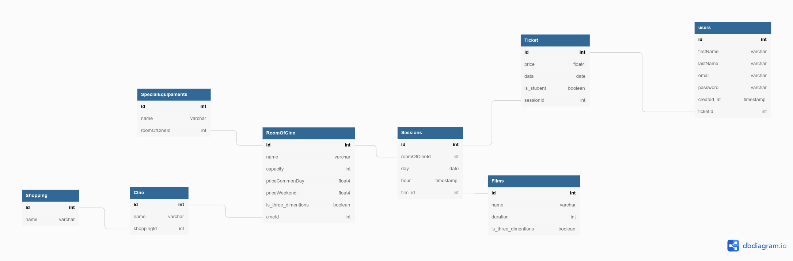

## CineMais

Sistema que gerencia a venda de ingressos para uma rede de cinema.
- Funcionalidades:
  - Cadastro de salas, filmes, sessões e usuários 
  - Venda, cancelamento e impressão de ingressos
  - Consulta de filmes e sessões filtradas por dia 
  - Verificar se existe vaga disponível em uma sala/sessão em uma data

## Requisitos

- [php ^8.0 ¹](https://www.php.net/)
- [composer ^1.0 ¹](https://getcomposer.org/download/)
- [docker ^20.10 ¹](https://docs.docker.com/docker-for-windows/install/)
- [wsl2 ²](https://docs.microsoft.com/pt-br/windows/wsl/install-win10)

¹ Ou docker

² Para windows

## Subindo a aplicação
- Realize o clone do projeto na sua máquina
- Acesse a pasta do projeto com o comando `cd cinemais`
- Na raiz do projeto execute `composer install` para instalar as dependências do projeto.
esse processo demora um pouco pois  os containers serão construídos em sua máquina
- Acesse o aplicativo em seu navador em: http://localhost

## Configurações
Copiar o arquivo sample.env tornando-o apenas .env e aplicando os valores para as respectivas variáveis:

    DATABASE_HOST=
    DATABASE_USER=
    DATABASE_PASSWORD=
    DATABASE_NAME=

## Estrutura
- ### Domain 
	- Entities: *Contém todas as entidades envolvidas em regras de negócio*
 	- Ports: *Contém todas as interfaces que serão implementadas dentro*
	- Factories: *Factories que irão criar instâncias de classes com dependências que podem ser complexas*
	- Repositories: *Repositórios responsáveis por fazer as operações de banco de dados utilizando um adapter*
	- Usecases: *Usecases executarão as regras de negócio*
- ### Infra
	- Controllers: *Porta de entrada para qualquer requisição*
	- Validators: *Responsável por validar informações vindas através da requisição*
	- Router: *Faz o match entre rota e função do controller*
	- Database: *Contém os adapters de banco de dados que implementam a interface criada no domínio*

## Como implementar um novo fluxo de negócio
-	Etapa 1: Criar a entidade que atuará naquele fluxo, caso não exista.
-	Etapa 2: Criar o repositório daquela entidade para que utilizará o adapter do banco para realizar as operações.
-	Etapa 3: Criar o Usecase responsável por realizar as operações de negócio e usando o repositório para aplicar no banco.
-	Etapa 4: Criar um factory para o Usecase, dessa forma não precisará se precupar sempre com as dependências da classe.
-	Etapa 5: Criar um controller e adicionar uma rota ao router registry para que a funcionalidade fique disponível.

## Diagrama de dados 

